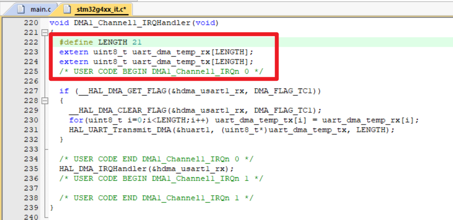

2024/7/17 03:15:11

v1.1.2

-   已添加发送“A55AA5A5”字符串，STM32收到后LCD显示功能界面1
-   ym的霸王茶姬真给力啊，困意全无QWQ
-   界面2中没有返回功能，导致当用户想要尽数阅览我们美丽的头像时必须rst这件事：
    -   让用户继续rst吧，🙏

-   下次晚上不喝霸王茶姬了，，，

>   by🔨

---

2024/7/16 23:38:11

v1.1.1

-  增加了汉字模文件，现在它能正常的显示汉字了
  
-  将头像图片添加进了代码显示中
  
-  修复了xwl的头像是🐸的bug
  
-  修复了头像文件放在static的bug

-  修复了无法显示的Hammer
  
-  移除了HIM
  
-  待修复：
  
    -  在main.c中定义的字符串将会神秘的被展示为乱码

    -  界面2中没有返回功能，导致当用户想要尽数阅览我们美丽的头像时必须rst😿

    -  cr把你的鼠标垫拿回去

> by🐸

---

2024/7.16 22:38

v1.1

-   功能1&功能2均已实现
-   but，汉字和图片没有放上去，这伟大的倒数第二步步交给xwl同志吧
-   还有一个最后“A55AA5A5”推出没写。（别催了，这就去写呜呜呜）

>   by🔨

---

2024/7/16

v1.04.00

-   解决在170MHz下屏幕一直不显示问题

    降低优化器。用O1或者其他低一些的即可
    
-   实现了功能界面1，注意以下几个问题：

    -   因为功能界面1三个按键都需要用到。所以进入功能界面1之后如果想要返回只能摁旁边黑色reset按钮

    -   功能界面2还没改好，别看

    -   因为编码问题，中文暂时（很快修复QWQ）用拼音代替。XWL SOS！！！
        > はい、はい💦

---

2024/7/15 20:00:00

v1.03.2

1.   按键消抖还是加上去了，虽然感知不强(甚至没有)
2.   中断回调函数里面还是加上了while来判断是否按键有没有离开触发(也就是等待按键松开，卡住循环执行)

>   PS: 另外xwl你写的文档格式好怪啊，我整个都改写了一下QWQ
>>    因为我是照着之前一点点仅剩的HTML知识写的文档qwq，所以是html的格式orz
---

2024/7/15 18:47:00

v1.03.1

SOS!!修复一个紧急bug：

-   如下代码应该在用户代码区，否则每次CubeMX生成代码都会丢失该三行代码

---

2024/7/13 16:49:32

v1.03

1.   为项目引入了串口通信，现在可以使用DMA的方式在USB接口与PC接收和发送信息了
2.   一些需要注意的地方
     -   代码中，当串口通信仅使用中断，不使用DMA，会出现丢失字节的问题（比如输入为1234567890，输出输入的字符串则可能得到123456890）
     -   目前使用的DMA通信要求当输入字符满足一定长度后，输出才会触发，如这里当设置输入长LENGTH=21时（根据要求即A55A+学号+A5A5+\n=21），输出即会返回这些字符串。不过实际使用时不一定为21（考虑到要求中所有字符不等长，并且还需要一些排错能力），并且还需要更复杂的判断逻辑，这里只是提供了DMA的架构。
3.   接下来处理GUI、通信逻辑等等，你们加油(ε: )

---

2024/7/12 17:25:43

v1.02

1.   改为了使用中断的方式处理按钮交互信息
2.   存在一些令人难以理解的机制
     -   每次中断结束，主函数执行都会重新执行一遍while循环
     -   <b>主频过快时，屏幕会出现严重的失真，当到达最高170Hz时，屏幕将完全无法显示任何东西</b>
     -   现使用的按钮消抖似乎没什么作用，尽管实际上好像也不需要这个消抖
3.   接下来将着手进行串口通讯相关内容——看起来很麻烦orz
4.   哦对了另外还有GUI没做，照着他那个来就行;)

---

7.10

全新(bushi)的开始

哈哈哈哈哈哈哈哈哈哈
